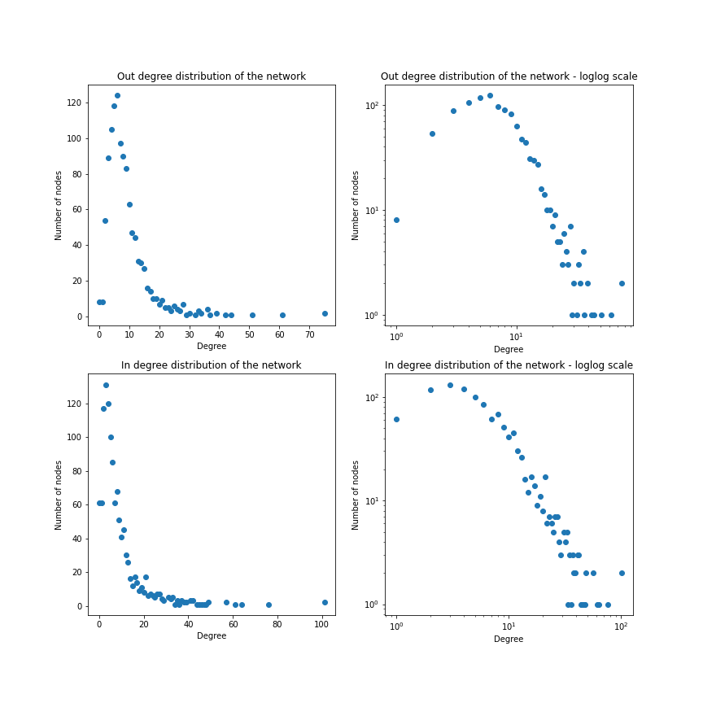
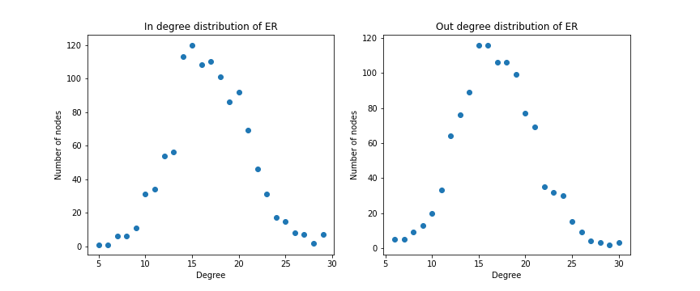

# The Human Body

The website is a result of the analysis made from [this Python notebook](link).

## Introduction

### What is this project?

The idea comes from an interest in the human body and mankinds knowledge of this subject. Wikipedia is a free webpage for learning about many subjects, and an incredible amount of unique pages about anatomy exist within. Using Wikipedia API, these pages can be extracted and analysed by creating networks, and examining the written text.

This project is all about the human body. Can we see how the internal body interacts within and out of systems by creating a network? Can we quickly learn about our anatomy without spending hours to read long, scientific pages? Does Wikipedia's information about anatomy reflect an actual anatomy textbook?

### What is the data?

A data file was manually created, containing the unique names of internal body parts and the systems that they belong to using a [Wikipedia page](https://en.wikipedia.org/wiki/List_of_organs_of_the_human_body) for inspiration.

The resulting .csv data-file can be found [here](https://github.com/noramurakozy/noramurakozy.github.io/blob/main/data/anatomy.csv).

Additionaly, an own cleaned version of the chapters of "Gray's Anatomy (41st edition)" (2015) is used for comparing the Wikipedia text to one of the biggest collections of knowledge of the human anatomy.

### Usage of "Gray's Anatomy"

Gray's Anatomy was chosen for comparison, as it describes all of human anatomy, and has continously been developed over many years. The 1st edition was released back in 1858, and is not on its 42nd release as of October, 2020, though only the prior version will be used for analysis in this project.

This could potentially mean that 5 years worth of results in research on the human anatomy is not included in this analysis, and information compared to Wikipedia pages could be outdated, just as the Wikipedia pages could be likely to have outdated information.

A PDF of the book was used to extract each chapter of the book into txt files. As the book has an absurd number of references to figures, chapters, commentary, etc., a bit of data cleaning was done by excluding some text in parenthesis, as it did not otherwise contribute to the text. Also, figure text and side nodes is not included in the analysis. An analysis of the text has been made, but will not be otherwise available.

References to other medical texts/people has not been removed from the chapter texts, as it could be significant to the text, though the words "et" and "al" has been added to the list of stopwords.

## A network of the human body

A network is created using Wikipedia API to extract the text on Wikipedia pages, along with their links to other Wikipedia pages. Every Wikipedia page is a node, and directed edges are made from the references of one Wikipedia to another Wikipedia page. The result: A directed network.

Every page in the data file, surprisingly, either has links to another page in the data file, or another page in the data file links to that page.
Thus, there is no reason to look at components

### The network

Let's start by simply visualizing the network.
For this, and further representations, undirected version of the networks are used, as they are easier to visualize.
Using [ForceAtlas2](https://github.com/bhargavchippada/forceatlas2) to draw the positions in the network, a basic representation of the network can be made, showing the nodes and edges.

<figure>
  
</figure>

> Figure 1: Network of the human body, simple version.

It can clearly be seen that some nodes have more connections than others, but not a lot can be said from this representation so far.
Let's do some further analysis of the network and return to the representation later.

### Connectivity

As defined by [[1]](#1): "The degree of a node in a network is the number of connections it has to other nodes, and the degree distribution is the probability distribution of these degrees over the whole network", we will study first the connectivity of the network. As this is a directed graph, we can easily check the most connected nodes, and the connections coming in and going out of each node. 

The pages with most references to other anatomy pages:
1.	Human brain with 75 degrees
2.	Sacral plexus with 61 degrees
3.	Cranial nerves with 51 degrees
4.	Hand with 44 degrees
5.	Pelvis with 42 degrees

Looking at the pages with most out degree, the human brain, hand and pelvis are all well known organs, with quite a few things going on, while sacral plexus contains a list of nerves, and cranial nerves talks about a lot of nerves.

The pages with most references from other anatomy pages:
1.	Artery with 101 degrees
2.	Facial nerve with 76 degrees
3.	Vein with 64 degrees
4.	Vagus nerve with 61 degrees
5.	Pelvis with 57 degrees

Looking at the pages with most in degree, it is no surprise that artery, vein and nerves are listed, as they are essential in many parts of the body. And, again, the pelvis area has a lot going on around it.

Let's also check the nodes with the most degrees in general (using an undirected version of the network). 
1.	**Artery with 106 degrees**
2.	Human brain with 83 degrees
3.	Pelvis with 82 degrees
4.	Facial nerve with 81 degrees
5.	Vein with 74 degrees

The most connected node in our network is the Artery, which plays an important role in the human body, because it's a blood vessel that takes blood away from the heart to one or more parts of the body, so it makes sense that this is the most referred node in the system. The second is the Human brain, which we expected to have among the most connected nodes. The third is the Pelvis, most probably because we have a lot vital organs in the pelvis area. The last 2 is the Facial nerve and the Vein, which play a very important role in our body as well.

Now, let's take a look at the over degree distribution.
<figure>
  
</figure>

> Figure 2: Out and In degree distribution of the human body network, in linear and logarithm scales.

Interestingly, there are only a few nodes with no or few references to other pages, where it seems to be common to have around eight references to other pages, with some pages having even more references.
It is more common for pages not to be refered to, which makes sense, but it is still more common to receive (what looks like) 5 references from other pages, which is quite a lot for the average page.

As a mean of further investigation, the created network distribution can be compared to that of a random network with the same number of nodes and connectivity.

<figure>
  
</figure>

> Figure 3: Random network degree distribution, in linear scale.

The above figure clearly shows that the degrees of a random network (ER) follow a Poisson distribution, therefore most nodes have comparable degrees and nodes with a large number of links are missing. While in a network with a power-law degree distribution, most nodes have only a few links. These numerous small nodes are held together by a few highly connected hubs.

### Centrality

**Degree centrality** is tied to the connectivity (degree) of a node and should also be the nodes with the highest number of combined in and out references. The 5 nodes with highest degree centrality are: *Artery*, *Facial nerve*, *Pelvis*, *Human brain* and *Vagus nerve*. The most pages are either referenced on these pages, or references to these pages.

**Betweenness centrality** is defined by how many times a given node happens to be on the shortest path between two nodes in the network. The 5 nodes with the highest betweenness centrality are: *Vein*, *Artery*, *Human brain*, *Hand*, and *Spinal nerve*. These are the pages you are most likely to go through when you are trying to get from one anatomical Wikipedia page to another on the shortest path. Interestingly, *Vein* has less direct connections, but are more likely to be passed through than *Artery* who had the highest degree.

**Eigenvector centrality** is defined by a nodes importance to the network, i.g. how many "important" nodes a given node is connected to. This is split up into "left" eigenvector centrality, i.g. the importance of the nodes that are referencing a given node, and by reversing the network, the eigenvector centrality referencing the importance of the nodes that are being referenced by a node can be found.

The 5 nodes with the highest eigenvector centrality corresponding to in-edges are: *Vagus nerve*, *Heart*, *Artery*, *Aorta* and *Trachea*. *Vagus nerve* by far has the highest eigenvector centrality, meaning that it is connected to other nodes which has a high importance to the connectivity of the network, meaning that it is probably very important to the general nervous system and the surrounding organs.

The 5 nodes with the highest eigenvector centrality corresponding to out-edges are: *Human brain*, *Common carotid artery*, *Aorta*, *Cranial nerves* and *Lung*. These nodes are the Wikipedia pages that are the most important to the network when looking at referencing other important nodes.

### Systems

The nodes in our network have an attribute called "System", which representd the system to which the node belong. In a further section we will also realize a text analysis  for the words in each of these systems.

The names of the systems in our network are:
 - Circulatory system
 - Digestive system 
 - Endocrine system
 - Integumentary system
 - Muscular system
 - Nervous system
 - Reproductive organs
 - Respiratory system
 - Urinary system

These systems were defined manually according to the Wikipedia source. Using this attributes to color the nodes accordingly, and scaling the nodes according to their respective degrees a more meaningful representation of the network is drawn.

<figure>
  
</figure>

> Figure 4: Network of the human body using ForceAtlas.

Here it can be seen that the network is not actually connected according to the defined systems.
Rather, as the node colors are quite widespread, it seems that the nodes could be connected according to their respective location in the body.

### Communities

To study why the nodes are connected in a specific way we are going to find the subnetworks in which the nodes are separated based on the number on links between them. For this we use a community detection method: the [Python Louvain-algorithm implementation](https://perso.crans.org/aynaud/communities/). The quality of the communities detected is measured by the modularity parameter. As said in [[2]](#2), "Modularity is a property of how one decides to partition a network: networks that are not partitioned and those that place every node in its own community will both have modularity equal to zero". With community detection the goal is to find communities that maximize modularity.

Now that we are more familiriaze with communitites, let's talk about the communities found on the human body graph. We got 9 communities, so we will continue the analisys with all of them as all of them are formed by a significant number of nodes. Here we present a distribution of the mentioned communities to show the number of communities and the amount of nodes in each one:

<figure>
  
</figure>

> Figure 5: Distribution of the networks's communities. It can easily be count the 9 communities.

When calculating the modularity for the partitions, we get a modularity over 0.5 . As explained in chapter 9 of the [Network Science book](http://networksciencebook.com/chapter/9#introduction9), based on modularity value the partition can be an "optimal partition", a 
"suboptimal partition", a "single community" or a "negative modularity". In our case, as the modularity is over 0.5 we have an "Optimal Partition".

This time using the communities to color the nodes, and again scaling the nodes according to their respective degrees, a representation of the community partition can be made.

<figure>
  
</figure>

> Figure 6: The human body network where the nodes are colored by the system they belongs to.

The same colored nodes are very different in this representation compared to that with the systems used for coloring.
This means that the systems and communities are definitely not the same.

## Text analysis

Now, let's take a look at the Wikipedia text. For this, the readable text on Wikipedia has been extracted and analysed.
For a broader understanding of the results, the text from Wikipedia is being compared to the chapter texts of "Gray's Anatomy (41st edition)" textbook.

### Results

Let's start by taking a look at the overall text stats.

As seen in Table 1, there are less words on the extracted Wikipedia pages, than in the textbook.
This can be interpreted as Wikipedia being less descriptive than the textbook, and the textbook is going into more detail about the organs.
It can also mean that everything described by the book is not represented by the extracted Wikipedia texts.
In any case, let's continue the analysis.

The next noticible thing in Table 1 is that the sentences are 2.50 words longer pr. sentence, indicating that Wikipedia, in general, is trying to say more in every sentence.
Later, we can see if this is the case by looking at stopwords, e.g. the, a, is, are.

Lastly, there is a lack of lexical richness (percentage of unique words) in the text.
This is most likely a result of the texts containing an extreme amount of words.
Knowing the texts, the number of unique words are even higher as a large result of references in both the textbook and Wikipedia.
One would also expect a shorter text to contain more lexical richness.

Text	|	Words	|	Sentences	|	Words pr. sentence	|	Unique words	|	% of text
---	|	---	|	---	|	---	|	---	|	---
Wikipedia	      |	 633058	|	24546	|	25.79	|	23025	|	3.64%
Gray's Anatomy  |	1084200	|	46554	|	23.29	|	24552	|	2.26%

> Table 1: General text information.

Moving on, Table 2 shows the usage of longs words in each text.
The textbook does have a higher percentage of words that are 10-19 letters long, which could indicate a more technical language or that words are hyphenated.
There seems to be an equally low usage of words with 20 letters or more.

Text | Long words (10+)	|	% of text	|	Long Words (15+)	|	% of text	|	Long words (20+)	|	% of text
--- | ---	|	---	|	---	|	---	|	---	|	---
Wikipedia      |  53284	|	 8.42%	|	3417	|	0.54%	|	192	|	0.03%
Gray's Anatomy | 109598	|	10.11%	|	8930	|	0.82%	|	299	|	0.03%

> Table 2: The word lengths.

Stopwords are words that are not very descriptive, and thus it is interesting to see how much of the text consists of such words.
Table 3 shows the amount of stopwords in the texts.
Interestingly, about 2/5 of the words used in both texts are not contributing to the overall comprehension of the texts.

Text	| Stopwords	|	% of text
---	| ---	|	---
Wikipedia	      | 269171	|	42.52%
Gray's Anatomy	| 456496	|	42.10%

> Table 3: Stopwords.

Next, let's have a look on the overall readability of the texts.
The readability is given by a Lix Score (low score being easy to read, and high score being hard to read), calculated from the amount of words, sentences, and words longer than 6 letters in a given text.
Table 4 shows the Lix Score of the two texts along with some other known litterary works for comparison.
The yield of this test shows that the text on Wikipedia describing anatomy are as difficult to read as that of the textbook.
This result makes sense, as sentences are a bit longer on Wikipedia, but longer words are used in the textbook.

Text | Lix Score
---- | ---------
[The Ugly Duckling](https://andersen.sdu.dk/vaerk/hersholt/TheUglyDuckling_e.html)   | 30
[The Holy Bible](https://raw.githubusercontent.com/mxw/grmr/master/src/finaltests/bible.txt)      | 42
Wikipedia           | 56
Gray's Anatomy      | 56
[The US Constitution](https://www.archives.gov/founding-docs/constitution-transcript) | 71

> Table 4: LIX readability analysis. LIX is a readability measure indicating the difficulty of reading a text, developed by Swedish scholar Carl-Hugo Björnsson. LIX was originally developed for Swedish texts, but it can be seen that applying it to litterary works in English has some merit. All texts in the table have been analyzed using the same algorithm.

Sentiment analysis was also done for the texts, to check if there were any indication that one text had a different sentiment than the other.
Looking at the other examples also used for the Lix scores, it can be seen that sentiment does not differ much between any of the different types of texts.

Text | Sentiment Score
---- | ---------
The Ugly Duckling   | 5.36
The Holy Bible      | 5.37
Wikipedia           | 5.25
Gray's Anatomy      | 5.24
The US Constitution | 5.30

> Table 5: Sentiment analysis for the same 5 texts. The sentiment of words (happiness average) are evaluated using [this page](https://journals.plos.org/plosone/article/file?id=10.1371/journal.pone.0026752.s001&type=supplementary).

Overall, the texts are surprisingly alike.
Few significant differences were found between Wikipedia pages describing anatomy, and a medical anatomy textbook.
Some explanations could be that the textbook is used for reference on some of the Wikipedia pages, that the way of writing in the field are very similar, or that medical texts are complicated no matter how its being written or by whom its being written by.
Table 5 shows the above tables collectively.

Text	|	Words	|	Sentences	|	Words pr. sentence	|	Unique words	|	% of text	|	long words (10+)	|	% of text	|	Long Words (15+)	|	% of text	|	Long words (20+)	|	% of text	|	Stopwords	|	% of text	|	Lix score	|	Sentiment score
---	|	---	|	---	|	---	|	---	|	---	|	---	|	---	|	---	|	---	|	---	|	---	|	---	|	---	|	---	|	---
Wikipedia	      |	 633058	|	24546	|	25.79	|	23025	|	3.64%	|	 53284	|	 8.42%	|	3417	|	0.54%	|	192	|	0.03%	|	269171	|	42.52%	|	56	| 5.25
Gray's Anatomy	|	1084200	|	46554	|	23.29	|	24552	|	2.26%	|	109598	|	10.11%	|	8930	|	0.82%	|	299	|	0.03%	|	456496	|	42.10%	|	56	|	5.24

> Table 6: Summation of the overall text analysis.

Further analyses have been done on the [Gray's Anatomy](https://noramurakozy.github.io/book) for those interested.

### Most common words

The texts were found to be equally readable, but let's see if the same words are being used on the Wikipedia pages and in the textbook.

For this, four wordclouds have been constructed, two using the most used words in the texts, and two showing the words that are more unique for each text - using **Term Frequency – Inverse Document Frequency (TF-IDF)** - to find these words. Term Frequency is is the number of times a term (word) occurs in a document. And TF-IDF is when that frequency of words is multiplied by a weight that adjust the fact that some words appear more frequently in general, so for example in our case the word "the" would have less importance than the word "heart". More information together with the equations to apply can be found [here](https://en.wikipedia.org/wiki/Tf–idf).

First, we have the wordclouds for the Wikipedia pages and the textbook when using only Term Frequency.

  |  
:-------------------------:|:-------------------------:
Figure 7: Wordclouds of the most frequent words for the Wikipedia Pages. | Figure 8: Wordclouds of the most frequent words for Gray's Anatomy book.

On the left, it can be seen that the frequent words on Wikipedia are mostly anotomical, but there are also some "Wikipedia words" that have snuck in,
e.g. "image", "text", and "page". On the right, the textbook also contains mainly anatomical words, but a few common words that do not mean much for the text, and was not filtered out as stopwords, are still present, e.g. "may" and "usually".

Next we see the wordclouds for both when using Term Frequency- Inverse Document Frequency.

  |  
:-------------------------:|:-------------------------:
Figure 9: Wordclouds weighted by Inverse Document Frequency for Wikipedia Pages. | Figure 10: Wordclouds weighted by Inverse Document Frequency for Gray's Anatomy book.

Now that the unique words of both texts have been filtered, the results are quite interesting. It can be seen that many of the words are still medical terms. "fiber" is, for example, mentioned more on Wikipedia than in the textbook. This is because the textbook usually referes to "fibres" a lot more. The opposite can be said about neurone, which Wikipedia does not really use, but the textbook does.
Another example is that "cell" is a common word in both texts, but is mentioned enough in the textbook to still make it through the TF-IDF filtering.
Besides the medical terms, present are also a lot of names, places, and other words that are used in referencing on Wikipedia, where the same cannot quite be found in the textbook.

### Systems
As said in the previous section of systems, we also create the wordclouds for them, which are 9 in total. The aim is to compare them with the communities wordclouds that are going to be created later. We repeat the same operations as before with the TF-IDF wordclouds, so we get the unique words of each system in our network. 

Before creating the wordclouds, we get the names of the systems:
 - Circulatory system
 - Digestive system 
 - Endocrine system
 - Integumentary system
 - Muscular system
 - Nervous system
 - Reproductive organs
 - Respiratory system
 - Urinary system
 
And with them we create the dictionary that will contains each system with its corresponding txt files. 

In this way we can get the TF-IDF values for all the systems and draw the following wordclouds:

  |  
:-------------------------:|:-------------------------:
Figure 11: Circulatory system wordcloud. | Figure 12: Digestive system wordcloud.

 

  |  
:-------------------------:|:-------------------------:
Figure 13: Endocrine system wordcloud. | Figure 14: Integumentary system wordcloud.

 

  |  
:-------------------------:|:-------------------------:
Figure 15: Muscular system wordcloud. | Figure 16: Nervous system wordcloud.

 

  |  
:-------------------------:|:-------------------------:
Figure 17: Reproductive organs wordcloud. | Figure 18: Respiratory system wordclouds.

 

  |  
:-------------------------:|:-------------------------:
Figure 19: Urinary system wordcloud. | 

 

It is already known how the systems are different, and the resulting words in each word cloud is quite predictable, but it is still interesting to compare the systems and communities.

### Communities

In this section we will apply TF-IDF to the communities as well, this will give us the common words within the communities that makes the community unique to the others. It is also interesting to see if the communities can be compared to the defined systems, or if they are completely different, this will be discussed in the next section.

As in previous points, first we get the list of tokens (words) of each community, calculate the TF-IDF values and then draw the wordclouds for each community:

  |  
:-------------------------:|:-------------------------:
Figure 20: Wordcloud of the Pelvis-Sacrum-Hip_bone community. | Figure 21: Wordclouds of the tooth-Ear-Trigeminal_nerve community.

 

  |  
:-------------------------:|:-------------------------:
Figure 22: Wordcloud of the Heart-Lung-Thyroid community. | Figure 23: Wordclouds of the Human_brain-Cerebellum-Spinal_cord community.

 

  |  
:-------------------------:|:-------------------------:
Figure 24: Wordcloud of the Scapula-Hand-Humerus community. | Figure 25: Wordclouds of the Human_skin-Tendon-Foot community.

 

  |  
:-------------------------:|:-------------------------:
Figure 26: Wordcloud of the Retina-Human_eye-Lens community. | Figure 27: Wordclouds of the Clitoris-Vagina-Vulva community.

 

  |  
:-------------------------:|:-------------------------:
Figure 28: Wordcloud of the Liver-Kidney-Pancreas community. | 

 

The title of each wordcloud are the three longest pages found in each commmunity. With them it is possible to get a better understanding of what each community contains.

For the "Pelvis-Sacrum-Hip bone" community, it is found that this community is in fact centered around the hip, pelvis, thigh area with words like: "vastus", "femur" and "gluteal".

Next, the "Human tooth-Ear-Trigeminal nerve" community again supports that this community is centered around the face and senses (except the eyes and brain), with common words like: "tongue", "olfactory" (sense of smell) and "mandibular" (lower jaw).

The common words in "Heart-Lung-Thyroid" community also shows that it has a lot to do with breathing (with lung being dominant), and the chest area with words like: "esophagus", "intercostal", "bronchus" and "rib".

The "Human brain-Cerebellum-Spinal cord" is a bit harder to interpret. It is still thought that this community is about the brain and most connected nervous system, but since a lot of nerves are spread around the communities, left are words like: "pineal", "cerebellar" and "willis", which still supports this claim. Surprisingly, the word "ventricle" is dominant in this community, but it is related to the heart.

The "Scapula-Hand-Humerus" community was thought to be about the arm or shoulder, and this is supported by the word cloud with common words like: "ulnar", "pollicis" and "elbow". Most of the presented words seem to be in the arm or shoulder somewhere.

Next up is the "Human skin-Tendon-Foot", which was thought to be a leg, and that "human skin" just happens to be here, as it was hard to place in a certain community. Words like: "tibial", "plantar" and "metatarsal" supports that the community is about the leg and foot.

The "Retina-Human eye-Lens (anatomy)" community the words are quite clearly all about the eye, e.g. "iris", "ciliary", "optic".

The "Clitoris-Vagina-Vulva" community has nicely collected everything about the male and female reproductive systems, and it is quite clear and cut.

Lastly, the "Liver-Kidney-Pancreas" community is also showing to be about the intestine zone.

This means that it can be concluded that the communities (and thus Wikipedia links) are mostly based on the organs placement in the body more than the anatomical systems that they belong to.

### Communities and System similarities and differences

It can be seen in the system word clouds that some common anatomical terms like "artery" in the circulatory system, "nucleus" in the nervous system, and "tendon" in the muscular system are more important in the systems wordclouds and not in the communities ones, meaning that these words are more spread out between the communities, this support again the claim that the communites mostly do not describe the systems. On the other hand, the wordcloud of the community about the reproductive organs is quite similar to the reproductive system wordcloud but still they give different importance to the same words.

## References
<a id="1">[1]</a> 
https://en.wikipedia.org/wiki/Degree_distribution

<a id="1">[2]</a> 
https://www.sciencedirect.com/topics/computer-science/community-detection

