# The Human Body

The website is a result of the analysis made from [this Python notebook](link).

## Introduction

### What is this project?

The idea comes from an interest in the human body and mankinds knowledge of this subject. Wikipedia is a free webpage for learning about many subjects, and an incredible amount of unique pages about anatomy exist within. Using Wikipedia API, these pages can be extracted and analysed by creating networks, and examining the written text.

This project is all about the human body. Can we see how the internal body interacts within and out of systems by creating a network? Can we quickly learn about our anatomy without spending hours to read long, scientific pages? Does Wikipedia's information about anatomy reflect an actual anatomy textbook?

### What is the data?

A data file was manually created, containing the unique names of internal body parts and the systems that they belong to using a [Wikipedia page](https://en.wikipedia.org/wiki/List_of_organs_of_the_human_body) for inspiration.

The resulting .csv data-file can be found [here](https://github.com/noramurakozy/noramurakozy.github.io/blob/main/data/anatomy.csv).

Additionaly, an own cleaned version of the chapters of "Gray's Anatomy (41st edition)" (2015) is used for comparing the Wikipedia text to one of the biggest collections of knowledge of the human anatomy.

### Usage of "Gray's Anatomy"

Gray's Anatomy was chosen for comparison, as it describes all of human anatomy, and has continously been developed over many years. The 1st edition was released back in 1858, and is not on its 42nd release as of October, 2020, though only the prior version will be used for analysis in this project.

This could potentially mean that 5 years worth of results in research on the human anatomy is not included in this analysis, and information compared to Wikipedia pages could be outdated, just as the Wikipedia pages could be likely to have outdated information.

A PDF of the book was used to extract each chapter of the book into txt files. As the book has an absurd number of references to figures, chapters, commentary, etc., a bit of data cleaning was done by excluding some text in parenthesis, as it did not otherwise contribute to the text. Also, figure text and side nodes is not included in the analysis. An analysis of the text has been made, but will not be otherwise available.

References to other medical texts/people has not been removed from the chapter texts, as it could be significant to the text, though the words "et" and "al" has been added to the list of stopwords.

## A network of the human body

A network is created using Wikipedia API to extract the text on Wikipedia pages, along with their links to other Wikipedia pages. Every Wikipedia page is a node, and directed edges are made from the references of one Wikipedia to another Wikipedia page. The result: A directed network.

Every page in the data file, surprisingly, either has links to another page in the data file, or another page in the data file links to that page.
Thus, there is no reason to look at components

### The network

Let's start by simply visualizing the network.
For this, and further representations, undirected version of the networks are used, as they are easier to visualize.
Using [ForceAtlas2](https://github.com/bhargavchippada/forceatlas2) to draw the positions in the network, a basic representation of the network can be made, showing the nodes and edges.

<figure>
  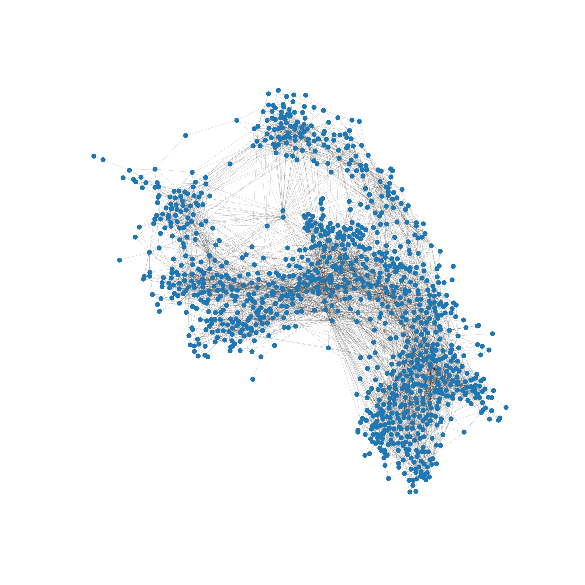
  <figcaption style="text-align: center" > <em> Figure 1 - Network of the human body, simple version. </em> </figcaption>
</figure>

It can clearly be seen that some nodes have more connections than others, but not a lot can be said from this representation so far.
Let's do some further analysis of the network and return to the representation later.

### Degree distribution

### Centrality

### Systems

The systems were defined manually according to the Wikipedia source. Using this attributes to color the nodes accordingly, and scaling the nodes according to their respective degrees a more meaningful representation of the network is drawn.

<figure>
  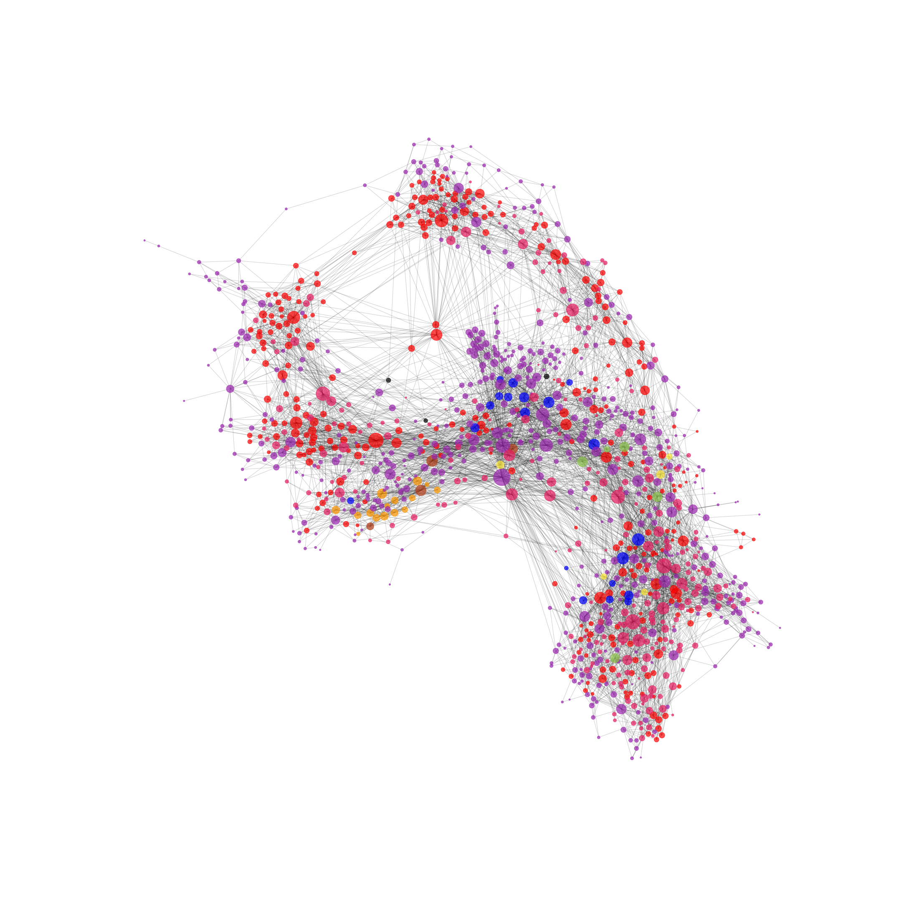
  <figcaption style="text-align: center" > <em> Figure 2 - Network of the human body using ForceAtlas. </em> </figcaption>
</figure>

Here it can be seen that the network is not actually connected according to the defined systems.
Rather, as the node colors are quite widespread, it seems that the nodes could be connected according to their respective location in the body.

### Communities

To study why the nodes are connected in a specific way we are going to find the subnetworks in which the nodes are separated based on the number on links between them. For this we use a community detection method: the [Python Louvain-algorithm implementation](https://perso.crans.org/aynaud/communities/). The quality of the communities detected is measured by the modularity parameter. As said in [1], "Modularity is a property of how one decides to partition a network: networks that are not partitioned and those that place every node in its own community will both have modularity equal to zero". With community detection the goal is to find communities that maximize modularity.

Now that we are more familiriaze with communitites, let's talk about the communities found on the human body graph. We got 9 communities, so we will continue the analisys with all of them as all of them are formed by a significant number of nodes. Here we present a distribution of the mentioned communities to show the number of communities and the amount of nodes in each one:

<figure>
  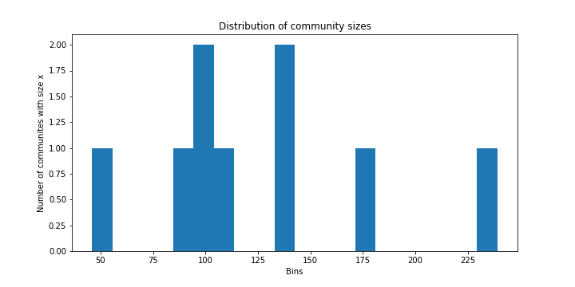
  <figcaption style="text-align: center" > <em> Figure 3 - Distribution of the networks's communities. It can easily be count the 9 communities.  </em> </figcaption>
</figure>

When calculating the modularity for the partitions, we get a modularity over 0.5 . As explained in chapter 9 of the [Network Science book](http://networksciencebook.com/chapter/9#introduction9), based on modularity value the partition can be an "optimal partition", a 
"suboptimal partition", a "single community" or a "negative modularity". In our case, as the modularity is over 0.5 we have an "Optimal Partition".

This time using the communities to color the nodes, and again scaling the nodes according to their respective degrees, a representation of the community partition can be made.

<figure>
  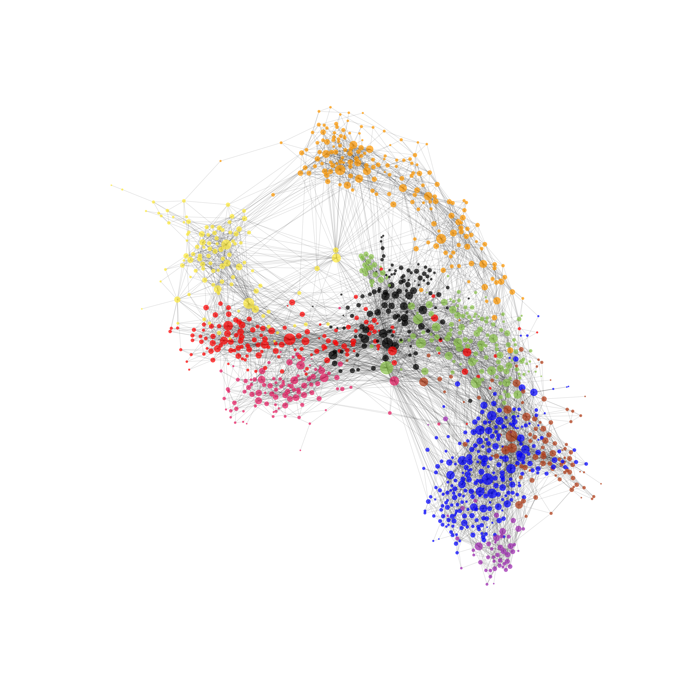
  <figcaption style="text-align: center" > <em> Figure 4 - The human body network where the nodes are colored by the system they belongs to. </em> </figcaption>
</figure>

The same colored nodes are very different in this representation compared to that with the systems used for coloring.
This means that the systems and communities are definitely not the same.

## Text analysis

Now, let's take a look at the Wikipedia text. For this, the readable text on Wikipedia has been extracted and analysed.
For a broader understanding of the results, the text from Wikipedia is being compared to the chapter texts of "Gray's Anatomy (41st edition)" textbook.

### Results

Let's start by taking a look at the overall text stats.

As seen in Table 1, there are less words on the extracted Wikipedia pages, than in the textbook.
This can be interpreted as Wikipedia being less descriptive than the textbook, and the textbook is going into more detail about the organs.
It can also mean that everything described by the book is not represented by the extracted Wikipedia texts.
In any case, let's continue the analysis.

The next noticible thing in Table 1 is that the sentences are 2.50 words longer pr. sentence, indicating that Wikipedia, in general, is trying to say more in every sentence.
Later, we can see if this is the case by looking at stopwords, e.g. the, a, is, are.

Lastly, there is a lack of lexical richness (percentage of unique words) in the text.
This is most likely a result of the texts containing an extreme amount of words.
Knowing the texts, the number of unique words are even higher as a large result of references in both the textbook and Wikipedia.
One would also expect a shorter text to contain more lexical richness.

Text	|	Words	|	Sentences	|	Words pr. sentence	|	Unique words	|	% of text
---	|	---	|	---	|	---	|	---	|	---
Wikipedia	      |	 633058	|	24546	|	25.79	|	23025	|	3.64%
Gray's Anatomy  |	1084200	|	46554	|	23.29	|	24552	|	2.26%

> Table 1: General text information.

Moving on, Table 2 shows the usage of longs words in each text.
The textbook does have a higher percentage of words that are 10-19 letters long, which could indicate a more technical language or that words are hyphenated.
There seems to be an equally low usage of words with 20 letters or more.

Text | Long words (10+)	|	% of text	|	Long Words (15+)	|	% of text	|	Long words (20+)	|	% of text
--- | ---	|	---	|	---	|	---	|	---	|	---
Wikipedia      |  53284	|	 8.42%	|	3417	|	0.54%	|	192	|	0.03%
Gray's Anatomy | 109598	|	10.11%	|	8930	|	0.82%	|	299	|	0.03%

> Table 2: The word lengths.

Stopwords are words that are not very descriptive, and thus it is interesting to see how much of the text consists of such words.
Table 3 shows the amount of stopwords in the texts.
Interestingly, about 2/5 of the words used in both texts are not contributing to the overall comprehension of the texts.

Text	| Stopwords	|	% of text
---	| ---	|	---
Wikipedia	      | 269171	|	42.52%
Gray's Anatomy	| 456496	|	42.10%

> Table 3: Stopwords.

Next, let's have a look on the overall readability of the texts.
The readability is given by a Lix Score (low score being easy to read, and high score being hard to read), calculated from the amount of words, sentences, and words longer than 6 letters in a given text.
Table 4 shows the Lix Score of the two texts along with some other known litterary works for comparison.
The yield of this test shows that the text on Wikipedia describing anatomy are as difficult to read as that of the textbook.
This result makes sense, as sentences are a bit longer on Wikipedia, but longer words are used in the textbook.

Text | Lix Score
---- | ---------
[The Ugly Duckling](https://andersen.sdu.dk/vaerk/hersholt/TheUglyDuckling_e.html)   | 30
[The Holy Bible](https://raw.githubusercontent.com/mxw/grmr/master/src/finaltests/bible.txt)      | 42
Wikipedia           | 56
Gray's Anatomy      | 56
[The US Constitution](https://www.archives.gov/founding-docs/constitution-transcript) | 71

> Table 4: LIX readability analysis. LIX is a readability measure indicating the difficulty of reading a text, developed by Swedish scholar Carl-Hugo Björnsson. LIX was originally developed for Swedish texts, but it can be seen that applying it to litterary works in English has some merit. All texts in the table have been analyzed using the same algorithm.

Sentiment analysis was also done for the texts, to check if there were any indication that one text had a different sentiment than the other.
Looking at the other examples also used for the Lix scores, it can be seen that sentiment does not differ much between any of the different types of texts.

Text | Sentiment Score
---- | ---------
The Ugly Duckling   | 5.36
The Holy Bible      | 5.37
Wikipedia           | 5.25
Gray's Anatomy      | 5.24
The US Constitution | 5.30

> Table 5: Sentiment analysis for the same 5 texts. The sentiment of words (happiness average) are evaluated using [this page](https://journals.plos.org/plosone/article/file?id=10.1371/journal.pone.0026752.s001&type=supplementary).

Overall, the texts are surprisingly alike.
Few significant differences were found between Wikipedia pages describing anatomy, and a medical anatomy textbook.
Some explanations could be that the textbook is used for reference on some of the Wikipedia pages, that the way of writing in the field are very similar, or that medical texts are complicated no matter how its being written or by whom its being written by.
Table 5 shows the above tables collectively.

Text	|	Words	|	Sentences	|	Words pr. sentence	|	Unique words	|	% of text	|	long words (10+)	|	% of text	|	Long Words (15+)	|	% of text	|	Long words (20+)	|	% of text	|	Stopwords	|	% of text	|	Lix score	|	Sentiment score
---	|	---	|	---	|	---	|	---	|	---	|	---	|	---	|	---	|	---	|	---	|	---	|	---	|	---	|	---	|	---
Wikipedia	      |	 633058	|	24546	|	25.79	|	23025	|	3.64%	|	 53284	|	 8.42%	|	3417	|	0.54%	|	192	|	0.03%	|	269171	|	42.52%	|	56	| 5.25
Gray's Anatomy	|	1084200	|	46554	|	23.29	|	24552	|	2.26%	|	109598	|	10.11%	|	8930	|	0.82%	|	299	|	0.03%	|	456496	|	42.10%	|	56	|	5.24

> Table 6: Summation of the overall text analysis.

Further analyses have been done on the [Wikipedia pages](https://noramurakozy.github.io/wiki) and [Gray's Anatomy](https://noramurakozy.github.io/book) for those interested.

### Most common words

The texts were found to be equally readable, but let's see if the same words are being used on the Wikipedia pages and in the textbook.

For this, four wordclouds have been constructed, two using the most used words in the texts, and two showing the words that are more unique for each text - using **Term Frequency – Inverse Document Frequency (TF-IDF)** - to find these words. Term Frequency is is the number of times a term (word) occurs in a document. And TF-IDF is when that frequency of words is multiplied by a weight that adjust the fact that some words appear more frequently in general, so for example in our case the word "the" would have less importance than the word "heart".

First, we have the wordclouds for the Wikipedia pages and the textbook when using only Term Frequency.

<figure>
  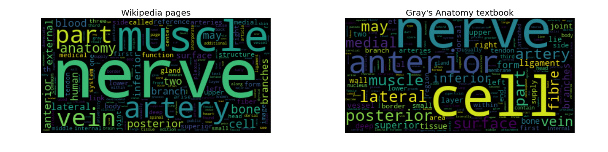
  <figcaption style="text-align: center" > 
    <em> 
      Figure 5 - Wordclouds that represents the most frequent words for the Wikipedia Pages and Gray's Anatomy book respectively. 
    </em> 
  </figcaption>
</figure>

Next we see the wordclouds for both when using Term Frequency- Inverse Document Frequency.

<figure>
  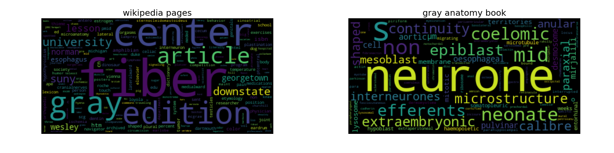
  <figcaption style="text-align: center" > 
    <em> 
      Figure 6 - Wordclouds that represents the most frequent words weighted by Inverse Document Frequency for the Wikipedia Pages and Gray's Anatomy book respectively. 
    </em> 
  </figcaption>
</figure>

CONCLUSION

### Systems
The nodes in our network have an attribute called "System", which represent the system in which the node belongs to. We also want to create the wordclouds for these systems, which are 9 in total, to compare with the communities ones that are going to be create later. We repeat the same operations as before with the TF-IDF wordclouds, so we get the unique words of each system in our network. 

Before creating the wordclouds, we get the names of the systems:
 - Circulatory system
 - Digestive system 
 - Endocrine system
 - Integumentary system
 - Muscular system
 - Nervous system
 - Reproductive organs
 - Respiratory system
 - Urinary system
 
And with them we create the dictionary that will contains each system with its corresponding txt files. 

Now we can get the TF-IDF values for all the system to draw the following wordclouds:

<figure>
  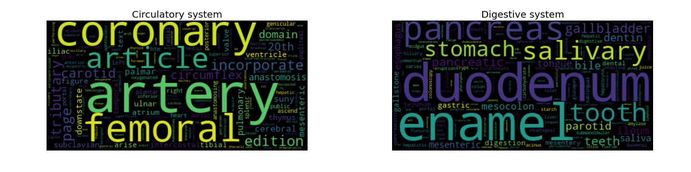
  <figcaption style="text-align: center" > <em> Figure 7 - Wordclouds for the circulatory and the digestive systems. </em> </figcaption>
</figure>

<figure>
  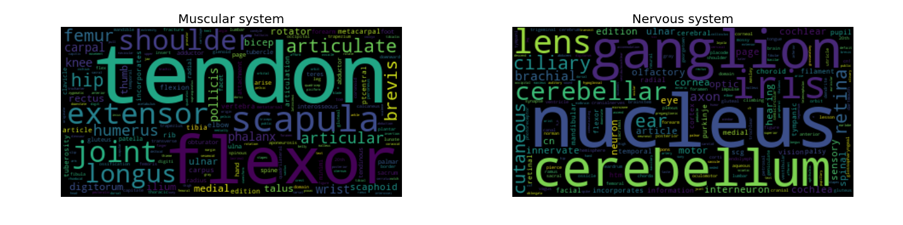
  <figcaption style="text-align: center" > <em> Figure 8 - Wordclouds for the muscular and the nervous systems. </em> </figcaption>
</figure>

<figure>
  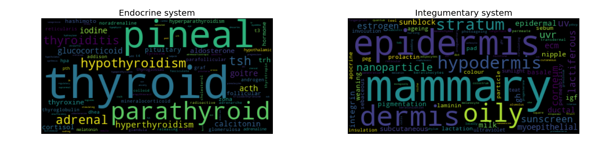
  <figcaption style="text-align: center" > <em> Figure 9 - Wordclouds for the endocrine and the integumentary systems. </em> </figcaption>
</figure>

<figure>
  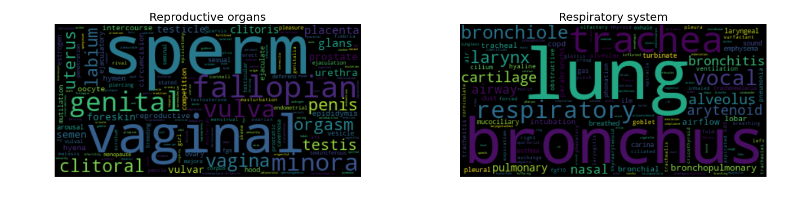
  <figcaption style="text-align: center" > <em> Figure 10 - Wordclouds for the reproductive and the respiratory systems. </em> </figcaption>
</figure>

<figure>
  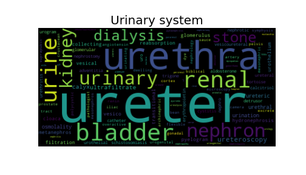
  <figcaption style="text-align: center" > <em> Figure 11 - Wordclouds for the urinary system. </em> </figcaption>
</figure>

CONCLUSION

### Communities

INTRODUCTION

IMAGES

  |  
:-------------------------:|:-------------------------:
Figure 12 - Wordcloud of a community. | Figure 13: Wordclouds of a community.

  |  
:-------------------------:|:-------------------------:
Figure 14 - Wordcloud of a community. | Figure 15: Wordclouds of a community.

  |  
:-------------------------:|:-------------------------:
Figure 16 - Wordcloud of a community. | Figure 17: Wordclouds of a community.

.png)  |  
:-------------------------:|:-------------------------:
Figure 18 - Wordcloud of a community. | Figure 19: Wordclouds of a community.

  |  
:-------------------------:|:-------------------------:
Figure 19 - Wordcloud of a community. | 

CONCLUSION

### Communities and System similarities and differences

## References
[1] https://www.sciencedirect.com/topics/computer-science/community-detection

## Conclusions

